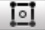

0x00. Unity - User Interface
============================

Specializations - AR/VR ― Unity

This project will go over the basics of Unity’s user interface. For this project, import Unity’s `Standard Assets` package from the [Asset Store](/rltoken/g9ZQWIPvHEyxUxJhVqCTSg "Asset Store"). Open one of the sample scenes and use it to play around with the windows, layouts, options, navigation methods, etc. covered in the reading. It’s necessary to get a feel for what tools are at your disposal and what they do before you use them! It will also make it easier to answer this project’s tasks.

The Unity project will not be used to grade this project’s tasks so don’t worry about saving it or making changes to it. You can open a scene by going to the Project window then choosing `Sample Scenes` then `Scenes` and double-clicking any scene (`Car` is recommended but any scene will work). While doing the reading, click on objects in the Scene window and play around with the interface to see what different tools and gizmos do.

You can also rearrange the Unity interface however you like! Just make sure you know where to find everything. :)

Resources
---------

**Read or watch**:

*   Installing Unity 2018
*   [Unity Interface Overview](https://www.youtube.com/watch?v=D7v2pjke5sc&feature=youtu.be "Unity Interface Overview")
*   [Unity Manual: Learning the interface](https://docs.unity3d.com/Manual/LearningtheInterface.html "Unity Manual: Learning the interface")
*   [Unity Manual: The Main Windows](https://docs.unity3d.com/Manual/UsingTheEditor.html "Unity Manual: The Main Windows")
*   [Unity Manual: Gizmos](https://docs.unity3d.com/Manual/GizmosMenu.html "Unity Manual: Gizmos")
*   [Unity Manual](https://docs.unity3d.com/Manual/index.html "Unity Manual")
*   [Unity Manual: Hotkeys](https://docs.unity3d.com/Manual/UnityHotkeys.html "Unity Manual: Hotkeys")
*   [Unity Manual: Using the Asset Store](https://docs.unity3d.com/Manual/AssetStore.html "Unity Manual: Using the Asset Store")

Learning Objectives
-------------------

At the end of this project, you are expected to be able to [explain to anyone](https://fs.blog/2012/04/feynman-technique/ "explain to anyone"), **without the help of Google**:

### General

*   How to navigate the Unity interface
*   What is the Scene view
*   What is the Game view
*   What is the Hierarchy window
*   What is the Project window
*   What is the Inspector window
*   What is the Console window
*   What is the Toolbar
*   What are the Play Buttons
*   What are the Transform tools
*   What are the Collab, Services, Account buttons
*   What are the Layers and Layouts dropdowns
*   What are Gizmos

Requirements
------------

### General

*   All your files should be only one line
*   All your files should end with a new line
*   All hotkey questions should be answered in all capital letters with `+` separating keystrokes. Use `CTRL/CMD` in your answer if the hotkey includes it. Examples: `CTRL/CMD + S`, `CTRL/CMD + SHIFT + C`, `F` Example:

    $ cat 100-answer
    2
    $
    

* * *

Quiz questions
--------------

#### Question #0

Which window shows the library of assets used in your project?

- [ ]   Scene
    
- [ ]   Game
    
- [ ]   Hierarchy
    
- [x]   Project
    
- [ ]   Inspector
    
- [ ]   Console
    
- [ ]   Toolbar
    

#### Question #1

Which window allows you to navigate and edit your scenes?

- [x]   Scene
    
- [ ]   Game
    
- [ ]   Hierarchy
    
- [ ]   Project
    
- [ ]   Inspector
    
- [ ]   Console
    
- [ ]   Toolbar
    

#### Question #2

Which window shows the hierarchy of every object in the scene?

- [ ]   Scene
    
- [ ]   Game
    
- [x]   Hierarchy
    
- [ ]   Project
    
- [ ]   Inspector
    
- [ ]   Console
    
- [ ]   Toolbar
    

#### Question #3

Which window shows all the properties of a selected object?

- [ ]   Scene
    
- [ ]   Game
    
- [ ]   Hierarchy
    
- [ ]   Project
    
- [x]   Inspector
    
- [ ]   Console
    
- [ ]   Toolbar
    

#### Question #4

Which window shows a representation of your game as it would look to the player?

- [ ]   Scene
    
- [x]   Game
    
- [ ]   Hierarchy
    
- [ ]   Project
    
- [ ]   Inspector
    
- [ ]   Console
    
- [ ]   Toolbar
    

#### Question #5

Which window shows logs of messages, warnings, and errors?

- [ ]   Scene
    
- [ ]   Game
    
- [ ]   Hierarchy
    
- [ ]   Project
    
- [ ]   Inspector
    
- [x]   Console
    
- [ ]   Toolbar
    

#### Question #6

Where can you find most of Unity’s features?

- [ ]   Scene
    
- [ ]   Game
    
- [ ]   Hierarchy
    
- [ ]   Project
    
- [ ]   Inspector
    
- [ ]   Console
    
- [x]   Toolbar
    

#### Question #7

What is a Gizmo in Unity?

- [ ]   A type of scene
    
- [x]   A visual setup aid used in the Scene view
    
- [ ]   A method for rigging 3D models
    

#### Question #8

What does the Scene Gizmo do?

- [ ]   Keeps a log of changes made in the Scene View
    
- [ ]   Allows you to switch between scenes in the Scene View quickly
    
- [x]   Displays the Scene View camera’s orientation and lets you change the camera’s angle and mode
   

#### Students who are done with "0. Project Window: Adding Assets"

#### 0\. Project Window: Adding Assets mandatory

Which of the following is **not** a method of adding new assets or subfolders to a project?

1.  Drag and drop the new asset to the Project window
2.  `File` > `New Asset`
3.  Click on the Create menu on the left side of the Project window’s toolbar

**Repo:**

*   GitHub repository: `holbertonschool-unity`
*   Directory: `0x00-unity-user_interface`
*   File: `0-project_add_new`

 

#### Correction of "0. Project Window: Adding Assets"

 

#### Students who are done with "1. Project Window: Filter Assets"

#### 1\. Project Window: Filter Assets mandatory

What are the ways you can filter assets in the Project window toolbar?

1.  by `Type` or `Label`
2.  by `Name` or `Value`
3.  by `Last Modified` or `Newest Created`

**Repo:**

*   GitHub repository: `holbertonschool-unity`
*   Directory: `0x00-unity-user_interface`
*   File: `1-project_filter`

 

#### Correction of "1. Project Window: Filter Assets"

 

#### Students who are done with "2. Project Window: Hotkey"

#### 2\. Project Window: Hotkey mandatory

What is the hotkey to switch to the Project window?

**Repo:**

*   GitHub repository: `holbertonschool-unity`
*   Directory: `0x00-unity-user_interface`
*   File: `2-project_hotkey`

 

#### Correction of "2. Project Window: Hotkey"

 

#### Students who are done with "3. Console Window: Hotkey"

#### 3\. Console Window: Hotkey mandatory

What is the hotkey to switch to the Console window?

**Repo:**

*   GitHub repository: `holbertonschool-unity`
*   Directory: `0x00-unity-user_interface`
*   File: `3-console_hotkey`

 

#### Correction of "3. Console Window: Hotkey"

 

#### Students who are done with "4. Scene View: X Axis"

#### 4\. Scene View: X Axis mandatory

What direction does the X axis represent?

1.  Left / Right
2.  Forward / Backward
3.  Up / Down

**Repo:**

*   GitHub repository: `holbertonschool-unity`
*   Directory: `0x00-unity-user_interface`
*   File: `4-scene_x`

 

#### Correction of "4. Scene View: X Axis"

 

#### Students who are done with "5. Scene View: Y Axis"

#### 5\. Scene View: Y Axis mandatory

What direction does the Y axis represent?

1.  Left / Right
2.  Forward / Backward
3.  Up / Down

**Repo:**

*   GitHub repository: `holbertonschool-unity`
*   Directory: `0x00-unity-user_interface`
*   File: `5-scene_y`

 

#### Correction of "5. Scene View: Y Axis"

 

#### Students who are done with "6. Scene View: Z Axis"

#### 6\. Scene View: Z Axis mandatory

What direction does the Z axis represent?

1.  Left / Right
2.  Forward / Backward
3.  Up / Down

**Repo:**

*   GitHub repository: `holbertonschool-unity`
*   Directory: `0x00-unity-user_interface`
*   File: `6-scene_z`

 

#### Correction of "6. Scene View: Z Axis"

 

#### Students who are done with "7. Scene View: Perspective and Isometric Views"

#### 7\. Scene View: Perspective and Isometric Views mandatory

You can toggle between Perspective and Isometric views by clicking the cube in the center of the Scene Gizmo.

**A.** 

**B.** 

Which scene is in Perspective mode and which scene is in Isometric mode?

1.  `A` = Perspective, `B` = Isometric
2.  `A` = Isometric, `B` = Perspective

**Repo:**

*   GitHub repository: `holbertonschool-unity`
*   Directory: `0x00-unity-user_interface`
*   File: `7-scene_perspective_isometric`

 

#### Correction of "7. Scene View: Perspective and Isometric Views"

 

#### Students who are done with "8. Scene View: Navigating Within Scenes"

#### 8\. Scene View: Navigating Within Scenes mandatory

Which of the following is **not** a way of navigating within the Scene view?

1.  Arrow keys
2.  Flythrough mode
3.  Pressing the `Play` button
4.  Hand tool

**Repo:**

*   GitHub repository: `holbertonschool-unity`
*   Directory: `0x00-unity-user_interface`
*   File: `8-scene_navigating`

 

#### Correction of "8. Scene View: Navigating Within Scenes"

 

#### Students who are done with "9. Scene View: Hotkey"

#### 9\. Scene View: Hotkey mandatory

What is the hotkey to switch to the Scene view?

**Repo:**

*   GitHub repository: `holbertonschool-unity`
*   Directory: `0x00-unity-user_interface`
*   File: `9-scene_hotkey`

 

#### Correction of "9. Scene View: Hotkey"

 

#### Students who are done with "10. Scene View: Hotkey - Center"

#### 10\. Scene View: Hotkey - Center mandatory

What is the hotkey for centering the view on a GameObject?

**Repo:**

*   GitHub repository: `holbertonschool-unity`
*   Directory: `0x00-unity-user_interface`
*   File: `10-scene_center`

 

#### Correction of "10. Scene View: Hotkey - Center"

 

#### Students who are done with "11. Game View - Rendered View"

#### 11\. Game View - Rendered View mandatory

Where does the Game view get its rendered view from?

1.  The view from the Scene view
2.  The view from the player character
3.  The cameras in the game

**Repo:**

*   GitHub repository: `holbertonschool-unity`
*   Directory: `0x00-unity-user_interface`
*   File: `11-game_view`

 

#### Correction of "11. Game View - Rendered View"

 

#### Students who are done with "12. Game View - Choose Camera"

#### 12\. Game View - Choose Camera mandatory

Which Game View toolbar menu lets you choose which camera to view from?

1.  Aspect
2.  Display
3.  Camera

**Repo:**

*   GitHub repository: `holbertonschool-unity`
*   Directory: `0x00-unity-user_interface`
*   File: `12-game_camera`

 

#### Correction of "12. Game View - Choose Camera"

 

#### Students who are done with "13. Game View - Aspect Ratios"

#### 13\. Game View - Aspect Ratios mandatory

Which Game View toolbar menu lets you test how your game looks with different aspect ratios?

1.  Screen
2.  Display
3.  Aspect

**Repo:**

*   GitHub repository: `holbertonschool-unity`
*   Directory: `0x00-unity-user_interface`
*   File: `13-game_aspect`

 

#### Correction of "13. Game View - Aspect Ratios"

 

#### Students who are done with "14. Game View - Zoom"

#### 14\. Game View - Zoom mandatory

Which of the following is **not** a method of zooming in and out in the Game view?

1.  Scroll wheel
2.  Scale slider
3.  `+` and `-`

**Repo:**

*   GitHub repository: `holbertonschool-unity`
*   Directory: `0x00-unity-user_interface`
*   File: `14-game_zoom`

 

#### Correction of "14. Game View - Zoom"

 

#### Students who are done with "15. Hierarchy Window: Order"

#### 15\. Hierarchy Window: Order mandatory

What is the default order of objects listed in the Hierarchy window?

1.  Order of creation
2.  Alphabetical
3.  Order of last modified

**Repo:**

*   GitHub repository: `holbertonschool-unity`
*   Directory: `0x00-unity-user_interface`
*   File: `15-hierarchy_order`

 

#### Correction of "15. Hierarchy Window: Order"

 

#### Students who are done with "16. Hierarchy Window: Reorder"

#### 16\. Hierarchy Window: Reorder mandatory

Which of the following is **not** a way of reordering objects in the Hierarchy window?

1.  Grouping objects as parent / child objects
2.  Modifying their position number property in the Inspector
3.  Dragging objects up and and down in the list

**Repo:**

*   GitHub repository: `holbertonschool-unity`
*   Directory: `0x00-unity-user_interface`
*   File: `16-hierarchy_reorder`

 

#### Correction of "16. Hierarchy Window: Reorder"

 

#### Students who are done with "17. Hierarchy Window: Parenting"

#### 17\. Hierarchy Window: Parenting mandatory

What is Parenting in Unity?

1.  Adding a parent template component to an object
2.  Duplicating an object from another and linking them
3.  Grouping objects where the topmost object is the parent and the objects grouped under it are child objects

**Repo:**

*   GitHub repository: `holbertonschool-unity`
*   Directory: `0x00-unity-user_interface`
*   File: `17-hierarchy_parenting`

 

#### Correction of "17. Hierarchy Window: Parenting"

 

#### Students who are done with "18. Hierarchy Window: Child Objects"

#### 18\. Hierarchy Window: Child Objects mandatory

How do you create a child object?

1.  Write a script associating an object to its parent object
2.  Drag and drop child object onto parent object
3.  Edit the child object’s parent property in the Inspector

**Repo:**

*   GitHub repository: `holbertonschool-unity`
*   Directory: `0x00-unity-user_interface`
*   File: `18-hierarchy_child`

 

#### Correction of "18. Hierarchy Window: Child Objects"

 

#### Students who are done with "19. Hierarchy Window: Hotkey"

#### 19\. Hierarchy Window: Hotkey mandatory

What is the hotkey for switching to the Hierarchy window?

**Repo:**

*   GitHub repository: `holbertonschool-unity`
*   Directory: `0x00-unity-user_interface`
*   File: `19-hierarchy_hotkey`

 

#### Correction of "19. Hierarchy Window: Hotkey"

 

#### Students who are done with "20. Inspector Window: GameObject Properties"

#### 20\. Inspector Window: GameObject Properties mandatory

How can you see the properties of a GameObject?

1.  Right-click on the GameObject and choose `Properties` from the menu
2.  Click on the GameObject’s gizmo
3.  Select the GameObject in the Hierarchy window or Scene view to view the properties in the Inspector window

**Repo:**

*   GitHub repository: `holbertonschool-unity`
*   Directory: `0x00-unity-user_interface`
*   File: `20-inspector_properties`

 

#### Correction of "20. Inspector Window: GameObject Properties"

 

#### Students who are done with "21. Inspector Window: Script Components"

#### 21\. Inspector Window: Script Components mandatory

If a GameObject has a script component, which part of the script is displayed in the Inspector window?

1.  Method name
2.  Public variables
3.  Return value

**Repo:**

*   GitHub repository: `holbertonschool-unity`
*   Directory: `0x00-unity-user_interface`
*   File: `21-inspector_script_component`

 

#### Correction of "21. Inspector Window: Script Components"

 

#### Students who are done with "22. Inspector Window: Multiple Windows"

#### 22\. Inspector Window: Multiple Windows mandatory

Can you have more than one Inspector window open at once?

1.  Yes
2.  No

**Repo:**

*   GitHub repository: `holbertonschool-unity`
*   Directory: `0x00-unity-user_interface`
*   File: `22-inspector_multiple`

 

#### Correction of "22. Inspector Window: Multiple Windows"

 

#### Students who are done with "23. Inspector Window: Hotkey"

#### 23\. Inspector Window: Hotkey mandatory

What is the hotkey for switching to the Inspector window?

**Repo:**

*   GitHub repository: `holbertonschool-unity`
*   Directory: `0x00-unity-user_interface`
*   File: `23-inspector_hotkey`

 

#### Correction of "23. Inspector Window: Hotkey"

 

#### Students who are done with "24. Toolbar: Rotate"

#### 24\. Toolbar: Rotate mandatory

Which Transform tool button rotates a GameObject?

1.  
2.  
3.  
4.  
5.  
6.  

**Repo:**

*   GitHub repository: `holbertonschool-unity`
*   Directory: `0x00-unity-user_interface`
*   File: `24-toolbar_rotate`

 

#### Correction of "24. Toolbar: Rotate"

 

#### Students who are done with "25. Toolbar: Pan"

#### 25\. Toolbar: Pan mandatory

Which Transform tool button pans around the Scene?

1.  
2.  
3.  
4.  
5.  
6.  

**Repo:**

*   GitHub repository: `holbertonschool-unity`
*   Directory: `0x00-unity-user_interface`
*   File: `25-toolbar_pan`

 

#### Correction of "25. Toolbar: Pan"

 

#### Students who are done with "26. Toolbar: Transform"

#### 26\. Toolbar: Transform mandatory

Which Transform tool button combines the Move, Rotate, and Scale tools into a single Gizmo?

1.  
2.  
3.  
4.  
5.  
6.  

**Repo:**

*   GitHub repository: `holbertonschool-unity`
*   Directory: `0x00-unity-user_interface`
*   File: `26-toolbar_transform`

 

#### Correction of "26. Toolbar: Transform"

 

#### Students who are done with "27. Toolbar: Scale"

#### 27\. Toolbar: Scale mandatory

Which Transform tool button scales a GameObject?

1.  
2.  
3.  
4.  
5.  
6.  

**Repo:**

*   GitHub repository: `holbertonschool-unity`
*   Directory: `0x00-unity-user_interface`
*   File: `27-toolbar_scale`

 

#### Correction of "27. Toolbar: Scale"

 

#### Students who are done with "28. Toolbar: Move"

#### 28\. Toolbar: Move mandatory

Which Transform tool button moves a GameObject?

1.  
2.  
3.  
4.  
5.  
6.  

**Repo:**

*   GitHub repository: `holbertonschool-unity`
*   Directory: `0x00-unity-user_interface`
*   File: `28-toolbar_move`

 

#### Correction of "28. Toolbar: Move"

 

#### Students who are done with "29. Toolbar: Transform 2D"

#### 29\. Toolbar: Transform 2D mandatory

Which Transform tool button combines the Move, Rotate, and Scale tools into a single Gizmo specifically for 2D layouts?

1.  
2.  
3.  
4.  
5.  
6.  

**Repo:**

*   GitHub repository: `holbertonschool-unity`
*   Directory: `0x00-unity-user_interface`
*   File: `29-toolbar_transform_2d`

 

#### Students who are done with "30. Toolbar: View Arrangement"

#### 30\. Toolbar: View Arrangement mandatory

Which Toolbar dropdown controls the arrangement of all Views?

1.  Layers
2.  Layout
3.  Account

**Repo:**

*   GitHub repository: `holbertonschool-unity`
*   Directory: `0x00-unity-user_interface`
*   File: `30-toolbar_views`

#### Students who are done with "31. Toolbar: Displayed Objects"

#### 31\. Toolbar: Displayed Objects mandatory

Which Toolbar dropdown controls which objects are displayed in the Scene View?

1.  Layers
2.  Layout
3.  Account

**Repo:**

*   GitHub repository: `holbertonschool-unity`
*   Directory: `0x00-unity-user_interface`
*   File: `31-toolbar_displayed_objects`