0x02. Unity - Scripting
=======================

Resources
---------

**Read or watch**:

*   [Unity Manual: Scripting Overview](https://docs.unity3d.com/Manual/ScriptingConcepts.html "Unity Manual: Scripting Overview") (_Read sections from “Creating and Using Scripts” to “Understanding Automatic Memory Management”_)
*   [Scripts as Behavior Components](https://learn.unity.com/tutorial/scripts-as-behaviour-components "Scripts as Behavior Components")
*   [How to make a Video Game in Unity - Programming](https://www.youtube.com/watch?v=9ZEu_I-ido4&feature=youtu.be "How to make a Video Game in Unity - Programming")
*   [How to make a Video Game in Unity - Movement](https://www.youtube.com/watch?v=Au8oX5pu5u4&feature=youtu.be "How to make a Video Game in Unity - Movement")
*   [How to make a Video Game in Unity - Camera Follow](https://www.youtube.com/watch?v=HVB6UVcb3f8&feature=youtu.be "How to make a Video Game in Unity - Camera Follow")
*   [Vector Maths](https://learn.unity.com/tutorial/vector-maths "Vector Maths")
*   [What Makes Great Games Great?](https://www.youtube.com/watch?v=aC3c_pcWwIQ "What Makes Great Games Great?")
*   [Unity Manual](https://docs.unity3d.com/Manual/index.html "Unity Manual")
*   [Unity Tutorials: Scripting](https://learn.unity.com/search?k=%5B%22tag%3A5814655a090915001868ebec%22%5D "Unity Tutorials: Scripting")
*   [Unity Manual: Vector3](https://docs.unity3d.com/ScriptReference/Vector3.html "Unity Manual: Vector3")

### General

*   What are scripts in Unity and how are they created and used
*   How to control GameObjects with scripts
*   What is an event function and how are the most common ones used
*   How to create and destroy GameObjects within scripts
*   How to use namespaces to organize classes
*   What are attributes and how to use them
*   How to use `Debug.Log()`
*   What is a vector

Requirements
------------

### General

*   A `README.md` file, at the root of the folder of the project
*   Use Unity’s default [.gitignore](https://github.com/github/gitignore/blob/master/Unity.gitignore ".gitignore") in your project folder
*   Push the entire repo `0x02-unity-scripting`, including `.meta` files
*   Scenes and project assets such as Materials must be named and organized as described in the tasks

* * *

Quiz questions
--------------

#### Question #0

What is MonoBehaviour?

- [ ]   A programming paradigm for games
    
- [X]   The base class from which every Unity script derives
    
- [ ]   A method of assigning behavior to an object
    

#### Question #1

When is `void Update()` called?

- [X]   Once every frame
    
- [ ]   When a change is made to the object the script is attached to
    
- [ ]   Once per game
    

#### Question #2

A script’s class name and file name must be the same to allow the script to be attached to a GameObject.

- [X]   True
    
- [ ]   False
    

#### Question #3

How can you allow your script’s variable values to be edited from Unity’s Inspector window?

- [ ]   Add an a `ShowInInspector` attribute
    
- [X]   Declare the variable as `public`
    
- [X]   Add a `SerializeField` attribute for private variables
    

#### Question #4

A Component is an instance of a class.

- [X]   True
    
- [ ]   False
    

#### Question #5

A GameObject can have more than one custom script attached to it.

- [X]   True
    
- [ ]   False
    

#### Question #6

What function creates a new GameObject?

- [ ]   `Create()`
    
- [ ]   `New()`
    
- [X]   `Instantiate()`
    

#### Question #7

What function deletes a GameObject?

- [X]   `Destroy()`
    
- [ ]   `Delete()`
    
- [ ]   `Remove()`
    

#### Question #8

Which of the following is a correctly formatted attribute in C#?

- [ ]   `@HideInInspector`
    
- [X]   `[HideInInspector]`
    
- [ ]   `// HideInInspector`
    

#### Question #9

What is a vector?

- [ ]   A fixed point in space
    
- [X]   An object that has both a magnitude and a direction
    
- [ ]   A line drawn between two points
    

#### Students who are done with "0. Ready player one"

#### 0\. Ready player one mandatory

Clone [this repository](https://github.com/alzheimeer/0x02-unity-scripting "this repository") containing a `maze` Unity project. You will build on this project by adding new GameObjects and scripts to create a https://holbertonschool.github.io/AR-VR/0x02-unity-scripting/index.html). This project should be pushed to its own repo called `0x02-unity-scripting`, **not** within a subdirectory.

Inside the `maze` scene, create a Sphere GameObject named `Player` with a Rigidbody component.

*   Position: `(23, 1.2, 16)`
*   Scale: `(2, 2, 2)`
*   Material Name: `player`
*   Material Color: `#0000FFFF`

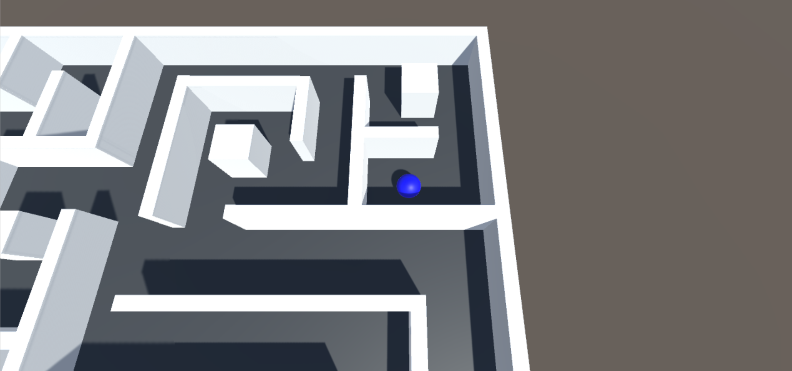

**Repo:**

*   GitHub repository: `0x02-unity-scripting`
*   File: `Assets/maze.unity, Assets/Materials/player.mat`

#### Students who are done with "1. Bust a move"

#### 1\. Bust a move mandatory

Create a directory `Scripts`. In this directory, create a new C# script called `PlayerController.cs`. Attach this script to the `Player` object. Within this script, update the `Start()` and `FixedUpdate()` functions to allow the `Player` to move when either the WASD or arrow keys are pressed

*   Movement should only be on the `X` and `Z` axes – the `Player` should not be able to jump.
*   There are many ways to create player movement depending on the way you want your player to behave. The way you implement player movement is up to you, as long as it is possible for `Player` to move through the maze.
*   Create a `public float speed` variable that can be edited in the Inspector to easily modify the `Player`‘s speed. The value of the `Player`’s speed is entirely up to you and how you implement player movement.

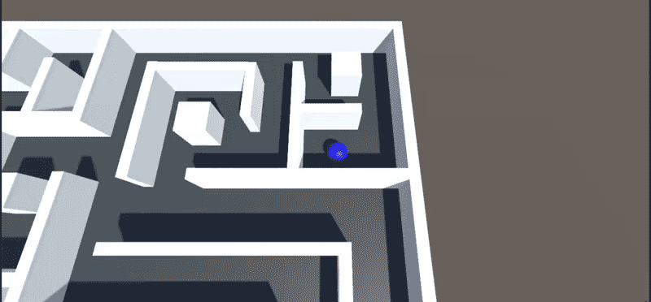

**Repo:**

*   GitHub repository: `0x02-unity-scripting`
*   File: `Assets/maze.unity, Assets/Scripts/PlayerController.cs`

#### Students who are done with "2. Camera ready"

#### 2\. Camera ready mandatory

Move the `Main Camera` to position `(22, 26, 7)`. Create a new C# script in the Scripts directory called `CameraController.cs`.

*   The script should have a `public GameObject player` variable that can be edited from the Inspector window.
*   The camera should follow the `Player` as it moves. In other words, when the player moves, the camera’s Transform position should also change relative to the `Player`.
*   The camera’s position should remain at a constant offset from the `Player`‘s position.
*   The camera does not need to rotate.

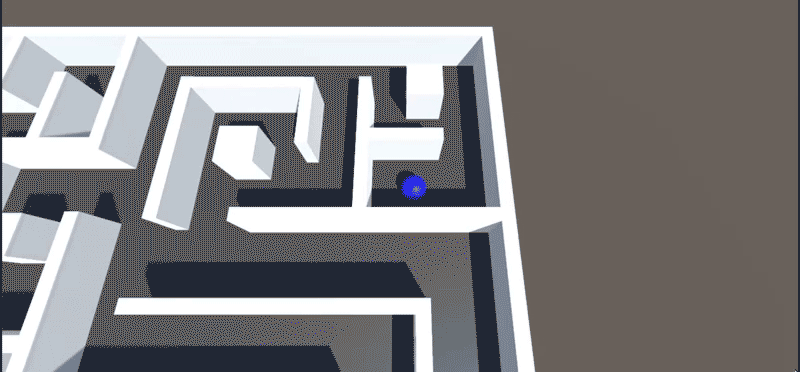

**Repo:**

*   GitHub repository: `0x02-unity-scripting`
*   File: `Assets/maze.unity, Assets/Scripts/CameraController.cs`

#### Students who are done with "3. Insert coin"

#### 3\. Insert coin mandatory

Create a new Cylinder GameObject named `Coin`.

*   Position: `(27, 1.7, 24)`
*   Rotation: `(0, 0, 90)`
*   Scale: `(1, .05, .8)`
*   Material Name: `coin`
*   Material Color: `#FFFF00FF`
*   Tag: `Pickup`
*   The `Coin`‘s Collider component should have `Is Trigger` checked ([Why?](https://learn.unity.com/tutorial/3d-physics "Why?"))
*   Turn `Coin` into a prefab inside a directory called `Prefabs`

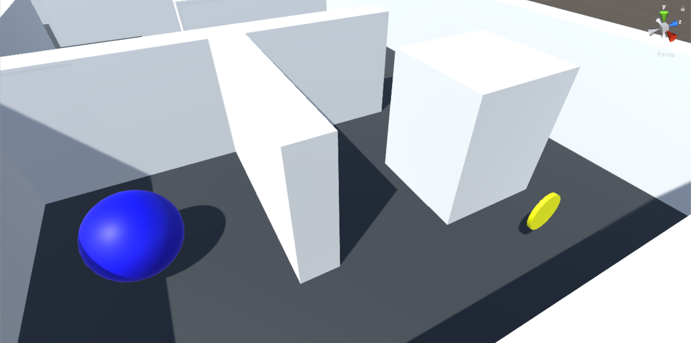

**Repo:**

*   GitHub repository: `0x02-unity-scripting`
*   File: `Assets/maze.unity, Assets/Prefabs/Coin.prefab, Assets/Materials/coin.mat`

#### Students who are done with "4. Coin collecting"

#### 4\. Coin collecting mandatory

Create a new C# script called `Rotator.cs` and attach it to `Coin`.

*   Within the `Update()` function, change the `x` value of the `Coin`‘s rotation to `45` over time.
*   Hint: [Time.deltaTime](https://docs.unity3d.com/ScriptReference/Time-deltaTime.html "Time.deltaTime")

Add a new `private int score` variable to your `PlayerController` script. Set the initial value of `score` to `0`.

Add the following new function to the script:

*   Prototype: `void OnTriggerEnter(Collider other)`
*   This function should increment the value of `score` when the `Player` touches an object tagged `Pickup`
*   Write the new value of `score` to the console using `Debug.Log()` with the format `Score: <value>`
*   The `Coin` object should be disabled or destroyed after the `Player` touches it

Place at least 20 total `Coin`s within the maze in any `X` / `Z` position you like, as long as they are visible to the player. Keep the `Y` position at `1.7` to ensure the player can reach them.

Create an empty GameObject named `Coins` to contain all the `Coin` objects in the Hierarchy window. Make sure the new empty GameObject’s `Scale` values are all set to `1` before dragging the `Coin` objects into the `Coins` object to avoid issues with the coins’ scaling and rotation.

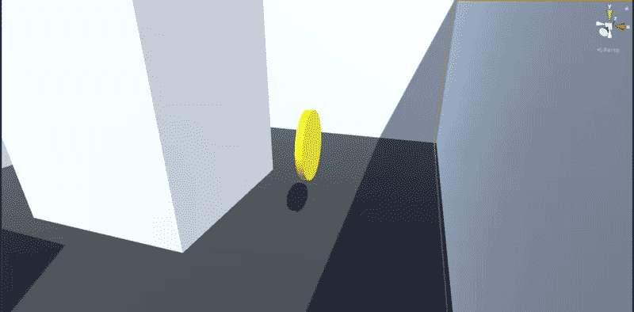

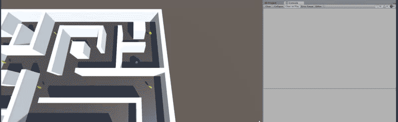

**Repo:**

*   GitHub repository: `0x02-unity-scripting`
*   File: `Assets/maze.unity, Assets/Scripts/PlayerController.cs, Assets/Scripts/Rotator.cs`

#### Students who are done with "5. Danger zone"

#### 5\. Danger zone mandatory

Create a new Plane GameObject named `Trap`.

*   Position: `(9.5, 0.26, 27)`
*   Scale: `(0.5, 1, 0.5)`
*   Material Name: `trap`
*   Material Color: `#FF0000FF`
*   Tag: `Trap`
*   The `Trap`‘s Collider component should have `Convex` and `Is Trigger` checked ([Why?](https://docs.unity3d.com/Manual/class-MeshCollider.html "Why?"))
*   Turn `Trap` into a prefab inside the `Prefabs` directory

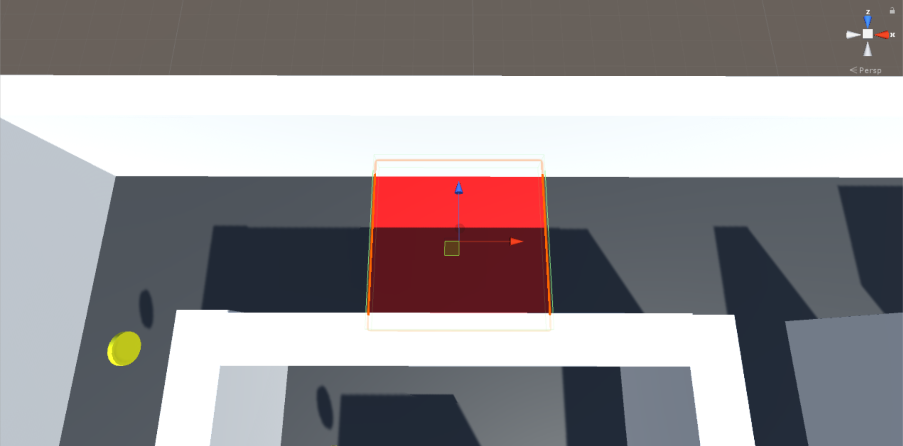

**Repo:**

*   GitHub repository: `0x02-unity-scripting`
*   File: `Assets/maze.unity, Assets/Prefabs/Trap.prefab, Assets/Materials/trap.mat`

#### Students who are done with "6. You've activated my trap card"

#### 6\. You've activated my trap card mandatory

Add a new `public int health` variable to your `PlayerController.cs` script. Set the initial value of `health` to `5`.

Add to the existing `void OnTriggerEnter(Collider other)` function:

*   This function should decrement the value of `health` when the `Player` touches an object tagged `Trap`
*   Write the new value of `health` to the console using `Debug.Log()` with the format `Health: <value>`

Place at least 8 total `Trap`s within the maze in any `X` / `Z` position you like, as long as they are visible to the player. Keep the `Y` position at `0.26` to ensure the player can touch them.

Create an empty GameObject named `Traps` to contain all the `Trap` objects in the Hierarchy window.

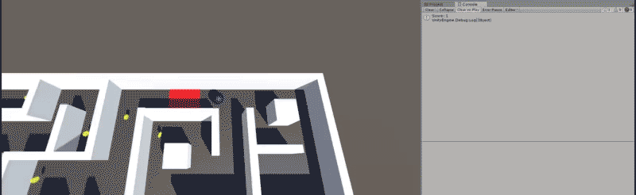

**Repo:**

*   GitHub repository: `0x02-unity-scripting`
*   File: `Assets/maze.unity, Assets/Scripts/PlayerController.cs`

#### Students who are done with "7. The finish line"

#### 7\. The finish line mandatory

Create a new Plane GameObject named `Goal`.

*   Position: `(-27, 0.26, 1.8)`
*   Scale: `(0.5, 1, 0.5)`
*   Material Name: `goal`
*   Material Color: `#00FF00FF`
*   Tag: `Goal`
*   The `Goal`‘s Collider component should have `Convex` and `Is Trigger` checked

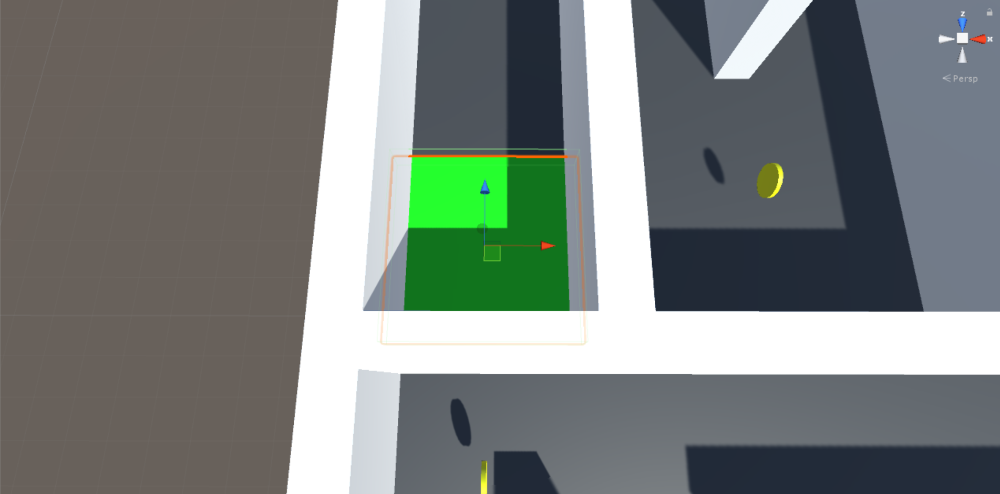

**Repo:**

*   GitHub repository: `0x02-unity-scripting`
*   File: `Assets/maze.unity, Assets/Materials/goal.mat`

#### Students who are done with "8. Goaaaaaaaaaaal"

#### 8\. Goaaaaaaaaaaal mandatory

In `PlayerController.cs`, add to the existing `void OnTriggerEnter(Collider other)` function:

*   When the `Player` touches an object tagged `Goal`, write `You win!` to the console using `Debug.Log()`

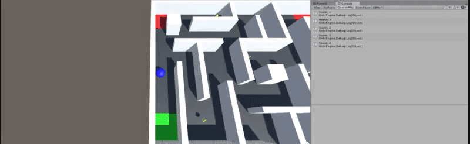

**Repo:**

*   GitHub repository: `0x02-unity-scripting`
*   File: `Assets/maze.unity, Assets/Scripts/PlayerController.cs`

#### Students who are done with "9. Game over"

#### 9\. Game over mandatory

Create an `Update()` function within `PlayerController.cs`.

*   This function should check if `health` equals `0`. If it does, write `Game Over!` to the console using `Debug.Log()`
*   If `health` equals `0`, reload the scene so that the `Player` starts again from the beginning
*   The `Player`‘s `health` and `score` should reset to their original values
*   You may have issues with the lighting preview in Unity when testing and reloading your scene. For more information, watch [Fix Lighting Going Dark in the Unity Editor When Resetting a Scene](https://www.youtube.com/watch?v=F-aUMLdIxRY "Fix Lighting Going Dark in the Unity Editor When Resetting a Scene")

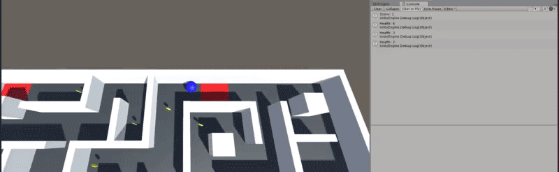

**Repo:**

*   GitHub repository: `0x02-unity-scripting`
*   File: `Assets/maze.unity, Assets/Scripts/PlayerController.cs`