0x03. Unity - UI
================

Resources
---------

**Read or watch**:

*   [Unity Manual: UI](https://docs.unity3d.com/Packages/com.unity.ugui@1.0/manual/index.html "Unity Manual: UI") (_Read sections Canvas to Interaction Components_)
*   [UI Canvas](https://learn.unity.com/tutorial/ui-components "UI Canvas")
*   [How to make a Video Game in Unity - Score & UI](https://www.youtube.com/watch?v=TAGZxRMloyU "How to make a Video Game in Unity - Score & UI")
*   [Start Menu in Unity](https://www.youtube.com/watch?v=zc8ac_qUXQY "Start Menu in Unity")
*   [The Four Elements of Game Design Part 1](https://gamedevelopment.tutsplus.com/articles/four-elements-of-game-design-1--cms-22720 "The Four Elements of Game Design Part 1")
*   [The Four Elements of Game Design Part 2](https://gamedevelopment.tutsplus.com/tutorials/four-elements-of-game-design-2--cms-25628 "The Four Elements of Game Design Part 2")
*   [I Have No Words & I Must Design](http://www.costik.com/nowords2002.pdf "I Have No Words & I Must Design")
*   [Game Accessibility Guidelines](http://gameaccessibilityguidelines.com/why-and-how/ "Game Accessibility Guidelines")
*   [Unity Manual](https://docs.unity3d.com/Manual/index.html "Unity Manual")
*   [Unity Manual: UI Reference](https://docs.unity3d.com/Packages/com.unity.ugui@1.0/manual/UIReference.html "Unity Manual: UI Reference")

### General

*   What is the Canvas
*   What is screen space vs world space
*   How to use the Rect Tool
*   What are anchors and how to use them
*   How to display and update information in the UI
*   What is a coroutine
*   How to create a menu
*   How to use Unity’s UI Interaction Components
*   What the alpha value of a color is
*   How to set and change material colors with scripts
*   What are common accessibility concepts to consider

Requirements
------------

### General

*   A `README.md` file, at the root of the folder of the project
*   Use Unity’s default `.gitignore` in your project folder
*   Push the entire project folder `0x03-unity-ui` to your repo
*   Scenes and project assets such as Scripts must be organized as described in the tasks
*   In your scripts, all your public classes and their members should have XML documentation tags
*   In your scripts, all your private classes and members should be documented but without XML documentation tags

* * *

Quiz questions
--------------

#### Question #0

All UI elements must be children of a Canvas GameObject.

- [X]    True
    
- [ ]    False
    

#### Question #1

There can only be one Canvas element in a scene.

- [ ]    True
    
- [X]    False
    

#### Question #2

UI elements are 2D.

- [X]    True
    
- [ ]    False
    

#### Question #3

What determines the order that UI elements are drawn on screen?

- [ ]    The order of creation
    
- [X]    The order in the Hierarchy
    
- [ ]    Their IDs
    

#### Question #4

Every UI element is represented as a rectangle.

- [X]    True
    
- [ ]    False
    

#### Question #5

What tool can be used specifically for manipulating UI elements?

- [X]    Rect Tool
    
- [ ]    UI Tool
    
- [ ]    Hand Tool
    

#### Question #6

What namespace is used for UI elements?

- [ ]    `UnityEngine.Interface`
    
- [ ]    `UnityEngine.CanvasElements`
    
- [X]    `UnityEngine.UI`
    

#### Question #7

In the Rect Transform box in the Inspector, Anchor Min corresponds to:

- [X]    Lower left anchor handle
    
- [ ]    Upper left anchor handle
    
- [ ]    Lower right anchor handle
    
- [ ]    Upper right anchor handle
    

#### Question #8

In the Rect Transform box in the Inspector, Anchor Max corresponds to:

- [ ]    Lower left anchor handle
    
- [ ]    Upper left anchor handle
    
- [ ]    Lower right anchor handle
    
- [X]    Upper right anchor handle
    

#### Students who are done with "0. Scoreboard"

#### 0\. Scoreboard mandatory

We’ll be building off the last project to add UI elements (see [example](https://holbertonschool.github.io/AR-VR/0x03-unity-ui/ "example")).

Clone your `0x02-unity-scripting` repo into a new repo called `0x03-unity-ui`. Like the previous project, this project should be inside its own repo, not within a subdirectory.

Create a new Canvas GameObject:

*   Render Mode: `Screen Space - Overlay`
*   Pixel Perfect: Yes
*   UI Scale Mode: `Scale With Screen Size`

Inside the Canvas, create a new UI Image GameObject and name it `ScoreBG`. Anchor it to the top right of the game window using Anchor Presets.

*   Pos X: `-80`
*   Pos Y: `-40`
*   Width: `100`
*   Height: `30`
*   Image color: `#000000`
*   Alpha: `200`

Create a new Text GameObject named `ScoreText`. Make `ScoreText` a child of `ScoreBG`. Anchor `ScoreText` to the middle of `ScoreBG` using Anchor Presets.

*   Width: `100`
*   Height: `30`
*   Text: `Score: 0`
*   Font size: `18`
*   Alignment: `Center` + `Middle`
*   Horizontal Overflow: `Overflow`
*   Font color: `#FFFFFF`

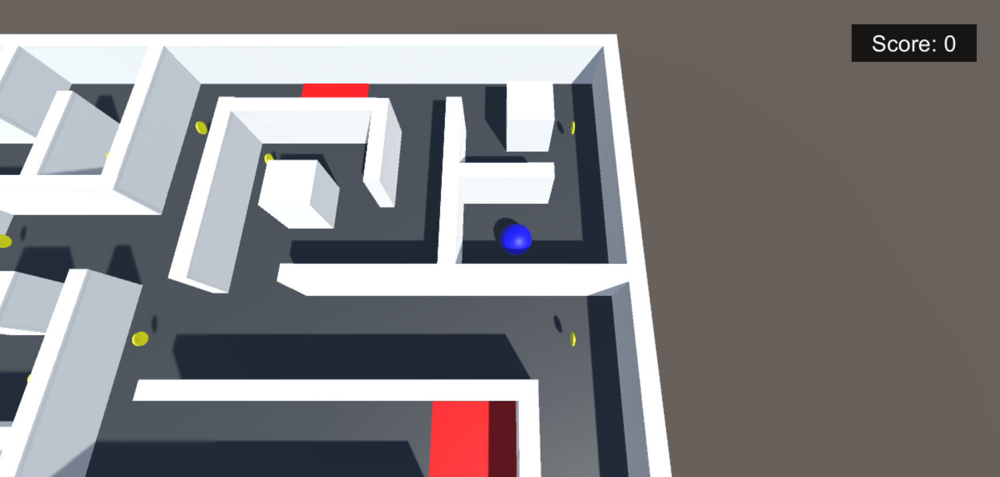

**Repo:**

*   GitHub repository: `0x03-unity-ui`
*   File: `Assets/maze.unity`

#### Students who are done with "1. What does "new high score" mean? Is that bad? Did I break it?"

#### 1\. What does "new high score" mean? Is that bad? Did I break it? mandatory

Edit the `PlayerController.cs` script. Create a new `public Text scoreText` variable. In the Inspector, set the value of the `scoreText` field to your `ScoreText` GameObject.

Create a new method `void SetScoreText()`.

*   When called, this method should update the `ScoreText` object with the `Player`‘s current score.
*   Remove or comment out your `Debug.Log` line printing `score` to the Console.

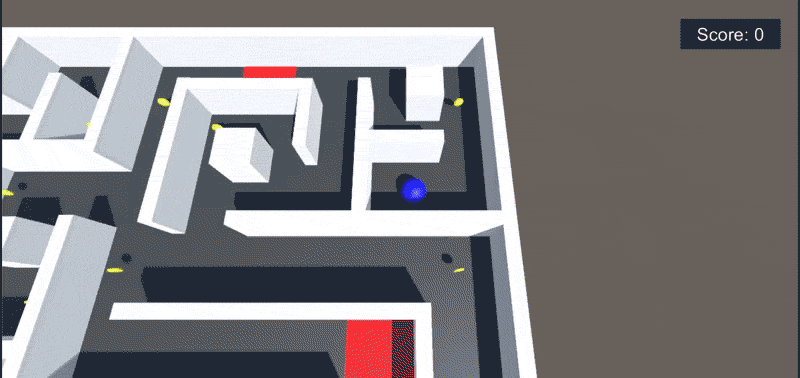

**Repo:**

*   GitHub repository: `0x03-unity-ui`
*   File: `Assets/maze.unity`

#### Students who are done with "2. HP"

#### 2\. HP mandatory

Inside the existing Canvas GameObject, create a new UI Image GameObject and name it `HealthBG`. Anchor it to the top left of the game window using Anchor Presets.

*   Pos X: `80`
*   Pos Y: `-40`
*   Width: `100`
*   Height: `30`
*   Image color: `#FF0000`
*   Alpha: `230`

Inside the existing Canvas GameObject, create a new Text GameObject called `HealthText`. Make `HealthText` a child of `HealthBG`. Anchor `HealthText` to the middle of `HealthBG` using Anchor Presets.

*   Width: `100`
*   Height: `30`
*   Text: `Health: 5`
*   Font size: `18`
*   Alignment: `Center` + `Middle`
*   Horizontal Overflow: `Overflow`
*   Font color: `#FFFFFF`

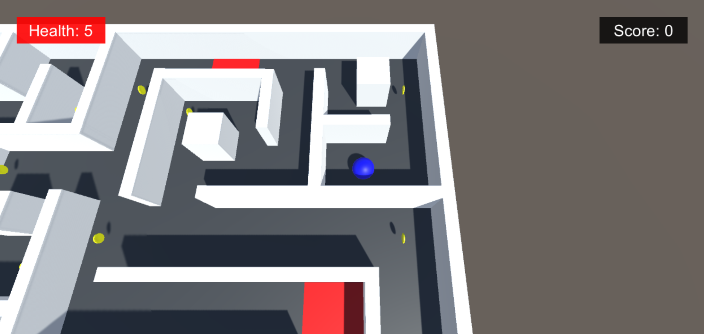

**Repo:**

*   GitHub repository: `0x03-unity-ui`
*   File: `Assets/maze.unity`

#### Students who are done with "3. Health inspection"

#### 3\. Health inspection mandatory

Edit the `PlayerController.cs` script. Create a new `public Text healthText` variable. In the Inspector, set the value of the `healthText` field to your `HealthText` GameObject.

Create a new method `void SetHealthText()`.

*   When called, this method should update the `HealthText` object with the `Player`‘s current `health`
*   Remove or comment out your `Debug.Log` line printing `health` to the Console

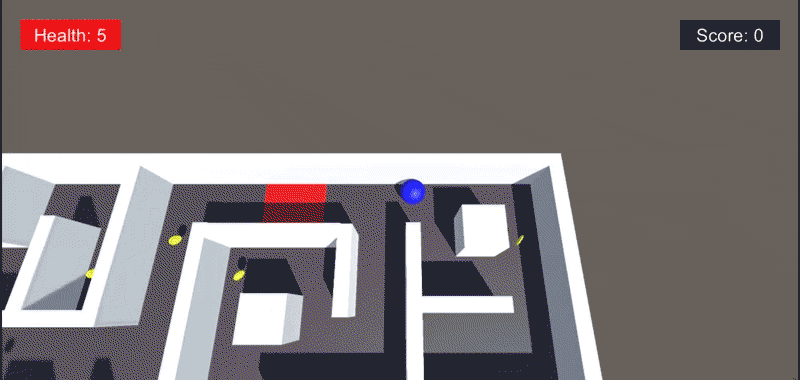

**Repo:**

*   GitHub repository: `0x03-unity-ui`
*   File: `Assets/maze.unity`

#### Students who are done with "4. Win, lose, or draw"

#### 4\. Win, lose, or draw mandatory

Inside the existing Canvas GameObject, create a new UI Image GameObject and name it `WinLoseBG`. Anchor it to the center of the game window using Anchor Presets.

*   Pos X: `0`
*   Pos Y: `70`
*   Width: `200`
*   Height: `60`
*   Image color: `#FF0000`

Inside the existing Canvas GameObject, create a new Text GameObject called `WinLoseText`. Make `WinLoseText` a child of `WinLoseBG`. Anchor `WinLoseText` to the middle of `WinLoseBG` using Anchor Presets.

*   Width: `160`
*   Height: `30`
*   Text: Leave empty for now
*   Font size: `14`
*   Alignment: `Center` + `Middle`
*   Horizontal Overflow: `Overflow`
*   Vertical Overflow: `Truncate`
*   Best Fit: Yes
*   Font color: `#FFFFFF`

Set `WinLoseBG` as inactive by unchecking the box next to the object’s name at the top of the Inspector.

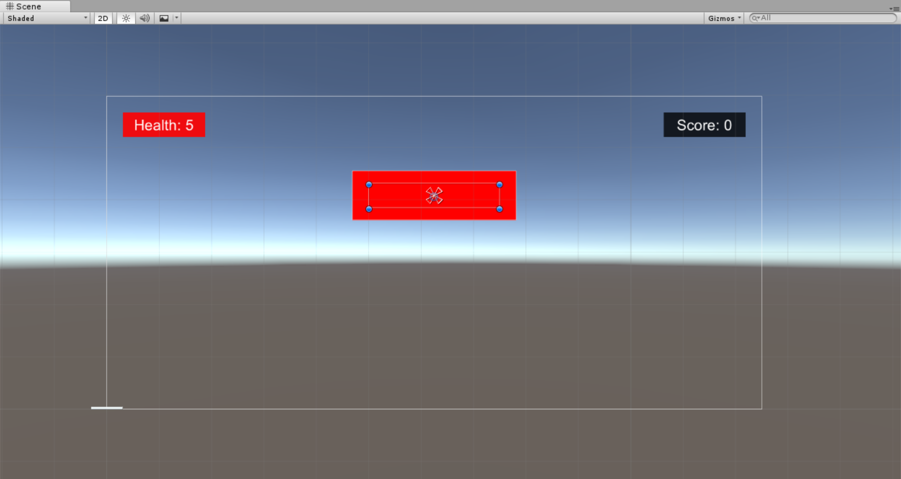

**Repo:**

*   GitHub repository: `0x03-unity-ui`
*   File: `Assets/maze.unity`

#### Students who are done with "5. Chicken dinner"

#### 5\. Chicken dinner mandatory

Edit the `PlayerController.cs` script so that when the `Player` touches the `Goal`:

*   `You Win!` displays in the `WinLoseText` UI element
*   `WinLoseText`‘s color changes to `black`
*   `WinLoseBG`’s color changes to `green`
*   Remove or comment out your `Debug.Log` line printing `You Win!` to the Console

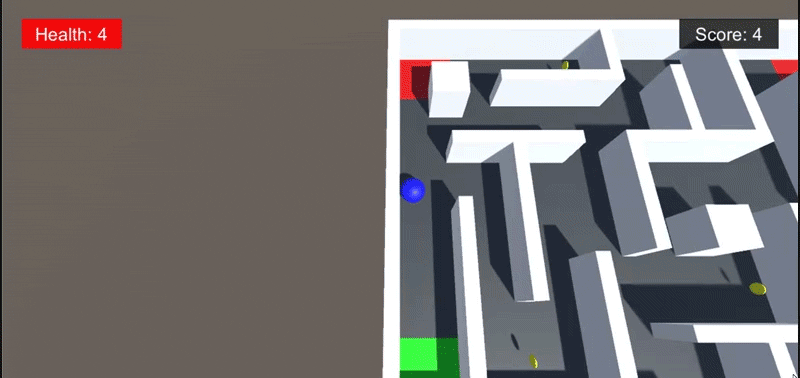

**Repo:**

*   GitHub repository: `0x03-unity-ui`
*   File: `Assets/maze.unity`

#### Students who are done with "6. Game over, man, game over"

#### 6\. Game over, man, game over mandatory

Edit the `PlayerController.cs` script so that when the `Player`‘s `health` reaches `0`:

*   `Game Over!` displays in the `WinLoseText` UI element
*   `WinLoseText`’s color changes to `white`
*   `WinLoseBG`’s color changes to `red`
*   Remove or comment out your `Debug.Log` line printing `Game Over!` to the Console

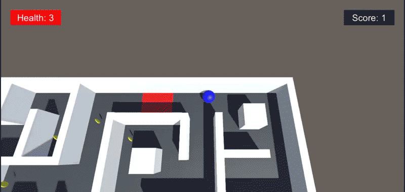

**Repo:**

*   GitHub repository: `0x03-unity-ui`
*   File: `Assets/maze.unity`

#### Students who are done with "7. Wait a second..."

#### 7\. Wait a second... mandatory

The transition from the `Game Over!` text and the scene reloading is very sudden and abrupt. Let’s use a [coroutine](https://docs.unity3d.com/Manual/Coroutines.html "coroutine") and `WaitForSeconds()` to create a delay where once the `Player`‘s `health` is `0` and the `Game Over!` text is displayed, the scene waits `3` seconds to reload.

Create a new method `IEnumerator LoadScene(float seconds)`:

*   This method should call `WaitForSeconds` before reloading the current scene
*   To utilize this method as a coroutine, call it with `StartCoroutine()` (ex. `StartCoroutine(LoadScene(3))`)

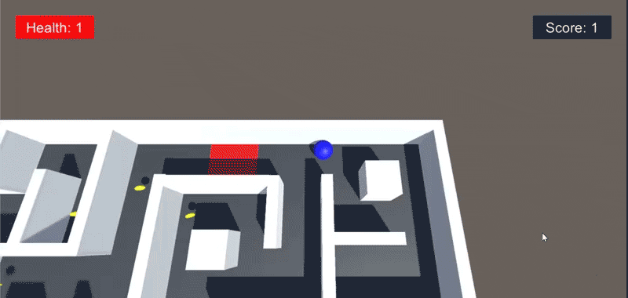

Let’s also use this method when the player wins to restart the game. Call `LoadScene()` when `Player` reaches the `Goal`.

**Repo:**

*   GitHub repository: `0x03-unity-ui`
*   File: `Assets/maze.unity`

#### Students who are done with "8. What's on the menu"

#### 8\. What's on the menu mandatory

Create a new scene called `Menu` in the Project window. Add a new UI Panel GameObject called `MenuBG`:

*   Color: `#313131`
*   Alpha: `200`

Inside the existing Canvas GameObject, create an empty GameObject called `MainMenu`. Anchor it to the center of the game window with Anchor Presets.

*   Width: `250`
*   Height: `200`

Inside `MainMenu`, create three UI Button GameObjects `PlayButton`, `OptionsButton`, `QuitButton`. Anchor them to the center of the game window using Anchor Presets.

*   `PlayButton` Pos Y: `60`
*   `OptionsButton` Pos Y: `0`
*   `QuitButton` Pos Y: `-60`
*   Width: `180`
*   Height: `40`
*   Normal Color: `#FFFFFF`
*   Highlighted Color: `#9EECBC`
*   Pressed Color: `#A9A9A9`

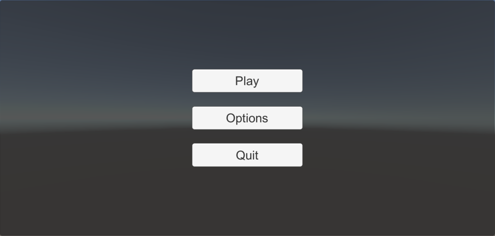

**Repo:**

*   GitHub repository: `0x03-unity-ui`
*   File: `Assets/menu.unity`

#### Students who are done with "9. Let's play"

#### 9\. Let's play mandatory

Create a new C# script `MainMenu.cs`. Create a new method `public void PlayMaze()`.

*   This method should load the `maze` scene when the `Play` button is pressed.
*   Under `File` > `Build Settings`, add your `menu` and `maze` scenes to the build.

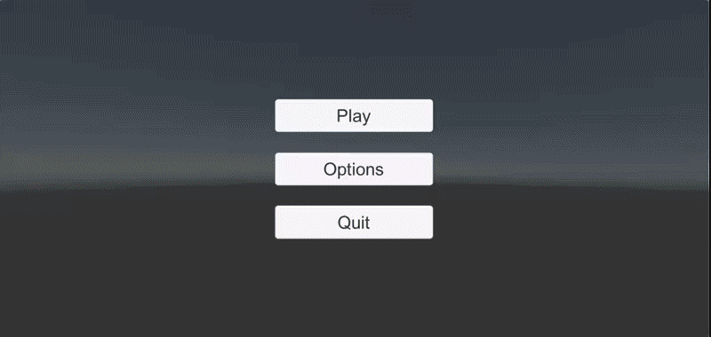

Inside the `PlayerController.cs` script, update the `Update()` script to check if the player presses the `Esc` key. If the `Esc` key is pressed, load the `menu` scene.

**Repo:**

*   GitHub repository: `0x03-unity-ui`
*   File: `Assets/menu.unity, Assets/Scripts/MainMenu.cs`

#### Students who are done with "10. We're not retreating, we're advancing! Toward future victory!"

#### 10\. We're not retreating, we're advancing! Toward future victory! mandatory

Inside the `MainMenu.cs` script, create a new method `public void QuitMaze()`.

*   This method should close the game window when the `Quit` button is pressed.
*   Since this will not work in the Unity editor preview, add a `Debug.Log()` message that writes `Quit Game` to the Console when the `Quit` button is pressed.

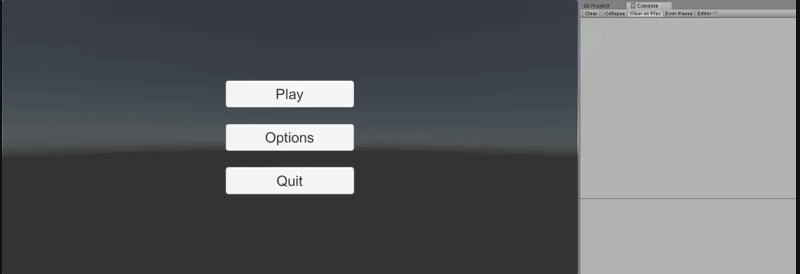

**Repo:**

*   GitHub repository: `0x03-unity-ui`
*   File: `Assets/menu.unity, Assets/Scripts/MainMenu.cs`

#### Students who are done with "11. A narrow variety of options"

#### 11\. A narrow variety of options mandatory

Inside the existing Canvas GameObject, create an empty GameObject called `OptionsMenu`. Anchor it to the center of the game window with Anchor Presets.

*   Width: `250`
*   Height: `200`

Create a new UI Text GameObject called `OptionsTitle` and anchor it to the top center of the `OptionsMenu` GameObject using Anchor Presets.

*   Width: `160`
*   Height: `30`
*   Text: `OPTIONS`
*   Font Style: `Bold`
*   Font Size: `24`
*   Alignment: `Center` + `Middle`
*   Horizontal Overflow: `Overflow`
*   Color: `#FFFFFF`

Duplicate one of the buttons from the `MainMenu` and rename it to `BackButton`. Change the text to `Back`. Anchor it to the bottom center of the `Options` Menu GameObject using Anchor Presets.

Set the `OptionsMenu` GameObject to inactive by unchecking the box next to the object’s name at the top of the Inspector.

Now, instead of creating a script to switch between the `MainMenu` and `OptionsMenu`, use the UI Button’s built-in `OnClick()` event instead.

*   `MainMenu` > `OptionsButton`: Create `OnClick()` events so that when this button is pressed, it sets `OptionsMenu` as active and `MainMenu` as inactive
*   `OptionsMenu` > `BackButton`: Create `OnClick()` events so that when this button is pressed, it sets `MainMenu` as active and `OptionsMenu` as inactive

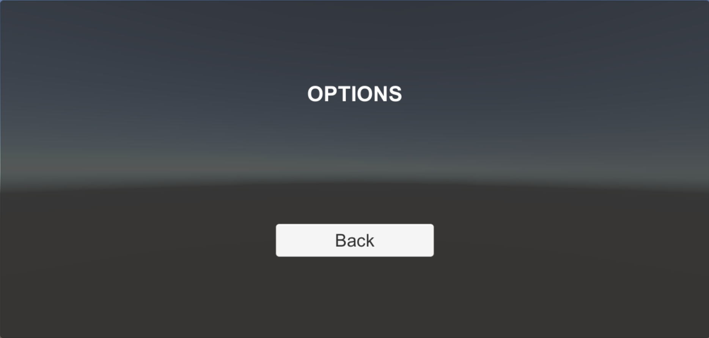

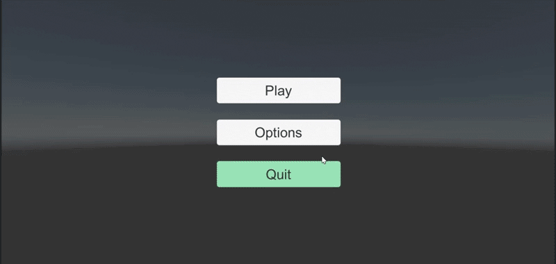

**Repo:**

*   GitHub repository: `0x03-unity-ui`
*   File: `Assets/menu.unity, Assets/Scripts/MainMenu.cs`

#### Students who are done with "12. Accessibility"

#### 12\. Accessibility mandatory

Having red traps and a green goal isn’t very accessible design for certain types of [colorblindness](https://www.color-blindness.com/types-of-color-blindness/ "colorblindness"). Ideally in game design, it would be better to avoid color coding important mechanics or objects entirely. For the sake of this UI project, we’ll add a Colorblind Mode option for our maze.

Add a UI Toggle GameObject called `ColorblindMode` to the `OptionsMenu` GameObject.

*   Toggle Label: `Colorblind Mode`
*   Label Text Alignment: `Left` + `Middle`
*   Position the checkbox on the right of the label as shown in the screenshots below

Edit the `MainMenu.cs` script and add three new variables:

*   `public Material trapMat`
*   `public Material goalMat`
*   `public Toggle colorblindMode`

In the Inspector, assign the materials `trap` and `goal` and the toggle `ColorblindMode` to their respective variables.

Within `PlayMaze()`, check if `colorblindMode` is toggled on. If it is, change the `trap` and `goal` material colors:

*   `trap` material color: `new Color32(255, 112, 0, 1)` (See: [Material.color](https://docs.unity3d.com/ScriptReference/Material-color.html "Material.color"), [Color32](https://docs.unity3d.com/ScriptReference/Color32.html "Color32"))
*   `goal` material color: `Color.blue`

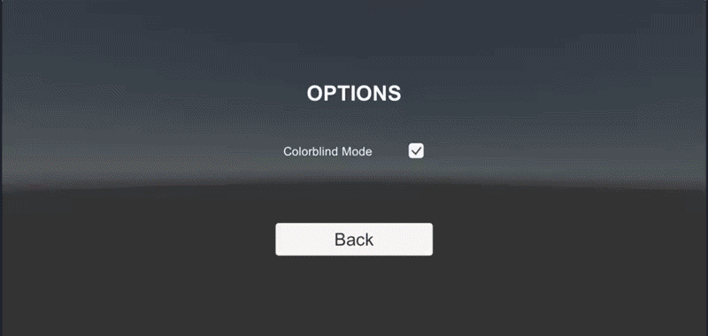

Otherwise, the maze should load with materials as their original red and green colors.

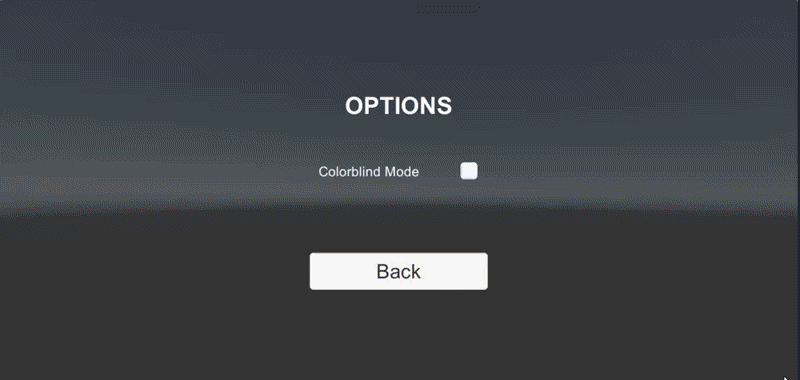

**Repo:**

*   GitHub repository: `0x03-unity-ui`
*   File: `Assets/menu.unity, Assets/Scripts/MainMenu.cs`