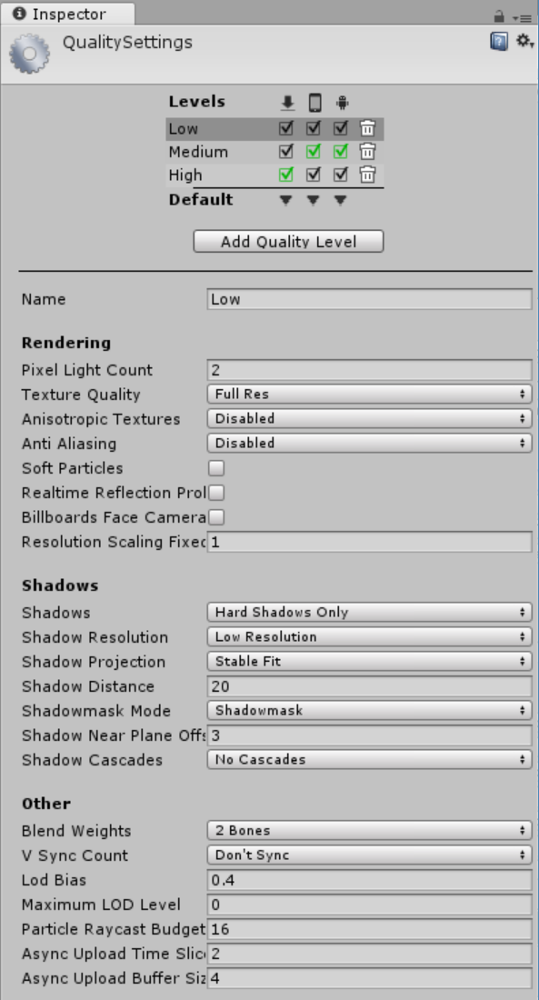

0x04. Unity - Publishing
========================

Specializations - AR/VR ― Unity

Resources
---------

**Read or watch**:

*   [Unity Manual: Cross-Platform Considerations](https://docs.unity3d.com/Manual/CrossPlatformConsiderations.html "Unity Manual: Cross-Platform Considerations")
*   [Unity Manual: Publishing Builds](https://docs.unity3d.com/Manual/PublishingBuilds.html "Unity Manual: Publishing Builds")
*   [Build and Player Settings](https://learn.unity.com/tutorial/building-a-project "Build and Player Settings")
*   [How to Build / Export Your Game in Unity](https://www.youtube.com/watch?v=7nxKAtxGSn8 "How to Build / Export Your Game in Unity") (_Skip section about Inno from 6:30 to 10.47_)
*   [Unity Profiler - Introduction](https://www.youtube.com/watch?v=lZdoniG6XXQ "Unity Profiler - Introduction")
*   [The Anatomy of a Game Design Document](https://www.gamasutra.com/view/feature/131791/the_anatomy_of_a_design_document_.php "The Anatomy of a Game Design Document")
*   [Unity Manual](https://docs.unity3d.com/Manual/index.html "Unity Manual")
*   [Unity Manual: Player Settings](https://docs.unity3d.com/Manual/class-PlayerSettings.html "Unity Manual: Player Settings")
*   [Unity Manual: Standalone Player Settings](https://docs.unity3d.com/Manual/class-PlayerSettingsStandalone.html "Unity Manual: Standalone Player Settings")
*   [Unity Manual: Quality Settings](https://docs.unity3d.com/Manual/class-QualitySettings.html "Unity Manual: Quality Settings")
*   [Unity Manual: Profiler Window](https://docs.unity3d.com/Manual/Profiler.html "Unity Manual: Profiler Window")

### General

*   How to publish a build
*   How to reorder scenes in a build
*   How to build a standalone application for Windows, Mac, and Linux
*   How to edit a project’s Quality Settings
*   How to add an icon to your build
*   What is the profiler and how to use it to check your project’s performance
*   What to consider when developing for different platforms

Requirements
------------

### General

*   A `README.md` file, at the root of the folder of the project
*   Use Unity’s default `.gitignore` in your project folder
*   Push the entire project folder `0x04-unity_publishing` to your repo
*   Scenes and project assets such as Scripts must be organized as described in the tasks
*   In your scripts, all your public classes and their members should have XML documentation tags
*   In your scripts, all your private classes and members should be documented but without XML documentation tags

* * *

Quiz questions
--------------

#### Question #0

What does `standalone` mean?

- [ ]    Builds of individual Unity scenes
    
- [ ]    Builds for mobile devices
    
- [X]    Builds for Windows, Mac, and Linux
    

#### Question #1

Does the order of scenes in the Build Settings window matter?

- [X]    Yes
    
- [ ]    No
    

#### Question #2

What tag prevents a GameObject from being included in a published build?

- [X]    `EditorOnly`
    
- [ ]    `DoNotBuild`
    
- [ ]    `BuildOnly`
    

#### Question #3

What does `Player Settings` refer to in a build process?

- [ ]    The controller of the `Player` object
    
- [X]    A set of options for the final build
    
- [ ]    The user’s choices in the game options
    

#### Question #4

What causes `tearing`?

- [ ]    Low resolution settings
    
- [X]    When Unity updates a frame while the display is still rendering the last frame
    
- [ ]    Textures that do not align correctly
    

#### Question #5

Which of the following is something to consider when developing for cross-platform projects?

- [X]    Input methods
    
- [X]    CPU performance
    
- [ ]    Method names
    

* * *

Tasks
-----

#### Students who are done with "0. Quality Settings"

#### 0\. Quality Settings mandatory

Clone your `0x03-unity-ui` repo into a new folder called `0x04-unity-publishing` inside your `holbertonschool-unity` repo.

In this project, you will be exploring how to publish a game to play on Windows, Mac, or Linux. If there are any changes or improvements you’d like to make to the `maze` in this repo, feel free! This project will only be checking your build settings and the final standalone game. If you do make changes to your `maze`, it’s strongly recommended to have a peer play it to make sure it works as intended.

Edit the project’s Quality Settings. Your project should have three quality levels:

**Low:**

**Medium:**

**High:**

**Repo:**

*   GitHub repository: `holbertonschool-unity`
*   Directory: `0x04-unity_publishing`
*   File: `Assets/maze.unity, ProjectSettings/QualitySettings.asset`

#### Students who are done with "1. Player Settings"

#### 1\. Player Settings mandatory

Edit the Player Settings for PC, Mac, & Linux Standalone. Unless otherwise specified below, leave settings with their default values. Create a new directory in the `Assets` folder called `Images`.

*   Company Name: Your name
*   Product Name: `Maze`
*   Default Icon: Use [this image](mazeicon.png "this image") or make your own (File name must be `mazeicon.png` and saved in directory `Assets/Images/`)

Resolution and Presentation:

*   Default Is Full Screen: Off
*   Default Screen Width: `1024`
*   Default Screen Height: `768`
*   Display Resolution Dialog: `Enabled`
*   Resizable Window: On

Splash Image:

*   Splash Style: `Light on Dark`
*   Animation: `Dolly`
*   Draw Mode: `Unity Logo Below`
*   Logos: Use [this image](mazelogo.png "this image") or make your own (File name must be `mazelogo.png` and saved in directory `Assets/Images/`)
*   Logo Duration: `4`

**Repo:**

*   GitHub repository: `holbertonschool-unity`
*   Directory: `0x04-unity_publishing`
*   File: `Assets/maze.unity, Assets/ProjectSettings.asset`

#### Students who are done with "2. Build Settings"

#### 2\. Build Settings mandatory

**Scenes in Build:**

1.  `menu`
2.  `maze`

Create three builds of the `maze` in a directory called `Builds` in the root of your project folder (**not** inside the Assets folder).

*   Windows and Linux builds should be set to `x86_64` architecture
*   Do not check `Development Build`

**Build Folder Hierarchy:**

*   Builds
    *   Linux
        *   Maze\_Data
        *   Maze.x86\_64
    *   Mac
        *   Maze.app
    *   Windows
        *   Maze\_Data
        *   Maze.exe
        *   UnityPlayer.dll

Make sure to run your build and make sure it works! It should open the Display Resolution Window, the logo splash screen, then finally the `menu`. Test your build on all three platforms if possible, but at the very least test on your own computer.

Create a `.zip` of each build:

*   `Maze_Mac.zip`
*   `Maze_Linux_x86_64.zip`
*   `Maze_Windows_x86_64.zip`

Upload the three `.zip` files to Google Drive or Dropbox. Add the links to the files below.

#### Add URLs here:

**Repo:**

*   GitHub repository: `holbertonschool-unity`
*   Directory: `0x04-unity_publishing`
*   File: `/Builds/Linux, /Builds/Mac, /Builds/Windows`

#### Students who are done with "3. Mobile maze"

#### 3\. Mobile maze #advanced

Create an iOS build or an Android build of the `maze`.

*   You cannot create a new Unity project – you must be able to build Windows, Mac, Linux, and iOS/Android builds all from `0x04-unity-publishing`
*   The game should load in landscape orientation
*   The `Player` must move with either touch controls or tilt controls
*   The `menu` buttons must work with touch controls
*   For iOS, create a `Menu` button in the `maze` scene that opens the `menu`
*   For Android, the back button should also open the `menu`
*   All other functionality of the maze should remain the same
*   It is not required to build for both iOS and Android, but you are welcome to do both if you have the resources to build and test for both.

Create a `.zip` of your build and upload to Google Drive or Dropbox. Add a link to the file below.

**Resources:**

*   [Building your Unity game to an iOS device for testing](https://learn.unity.com/tutorial/building-for-mobile#5c7f8528edbc2a002053b4a1 "Building your Unity game to an iOS device for testing ")
*   [Building your Unity game to an Android device for testing](https://learn.unity.com/tutorial/building-for-mobile#5c7f8528edbc2a002053b4a2 "Building your Unity game to an Android device for testing")

#### Add URLs here:

**Repo:**

*   GitHub repository: `holbertonschool-unity`
*   Directory: `0x04-unity_publishing`
*   File: `Assets/Maze.unity, Assets/Builds/iOS, Assets/Builds/Android`